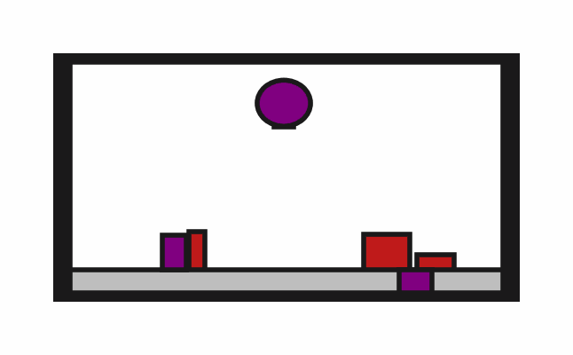

# PRBench


A **p**hysical **r**easoning **bench**mark for robotics.

This is a benchmark for task and motion planning (TAMP), reinforcement learning, robot foundation models, and combinations of all of the above. Environments have:

:white_check_mark: Long horizons
:white_check_mark: Sparse rewards
:white_check_mark: Tricky constraints
:white_check_mark: Diverse task distributions

*One simple example. More coming soon!*



## :clock1: Status

For currently implemented environments, see `docs/envs`.

To even call this "pre-alpha" would be generous. Unless you have had a direct conversation with a maintainer, this code is not ready for you! But check back soon.

## :zap: Usage Example

```python
import prbench
prbench.register_all_environments()
env = prbench.make("prbench/Obstruction2D-o3-v0")  # 3 obstructions
obs, info = env.reset()  # procedural generation
action = env.action_space.sample()
next_obs, reward, terminated, truncated, info = env.step(action)
img = env.render()  
```

## :airplane: Overview

This is a challenging benchmark for task and motion planning (TAMP), reinforcement learning, robot foundation models, and any combinations of all of the above. Additional description coming soon.

## :octocat: Contributing

### :ballot_box_with_check: Requirements
1. Python 3.10+
2. Tested on MacOS Catalina and Ubuntu 22.04 (but we aim to support most platforms)

### :wrench: Installation
1. Recommended: create and source a virtualenv (perhaps with [uv](https://github.com/astral-sh/uv))
2. `pip install -e ".[develop]"`
3. `pre-commit install`

### :microscope: Check Installation
Run `./run_ci_checks.sh`. It should complete with all green successes.

### :mag: General Guidelines
* All checks must pass before code is merged (see `./run_ci_checks.sh`)
* All code goes through the pull request review process

### :new: Adding New Environments
Detailed instructions to be added soon. For now, please see the examples in `src/prbench/env`. Also consider:
* Environments are registered in `src/prbench/__init__.py`
* Documentation is autogenerated with `scripts/generate_env_docs.py`, which is triggered on precommit (see `.pre-commit-config.yaml`)
* Each environment should have at least one demonstration (see `scripts/collect_demos.py`)
* After collecting a demonstraction, create a video with `scripts/generate_demo_video.py`, which will be used in the autogenerated documentation

### :oncoming_automobile: Roadmap
For specific environments, we will use issue tracking. Here are higher level TODOs:

- [ ] Write "challenges for physical reasoning" in README
- [ ] Decide which simulator(s) to use for 3D environments
- [ ] Determine what metrics we want to record, and how
- [ ] Run reinforcement learning baselines
- [ ] Create interface to PDDLStream
- [ ] Create interface to "task then motion planning"
- [ ] Run "code as policies" type baselines
- [ ] Collect at least 100 demonstrations per environment
- [ ] Run imitation learning baselines
- [ ] Create website
