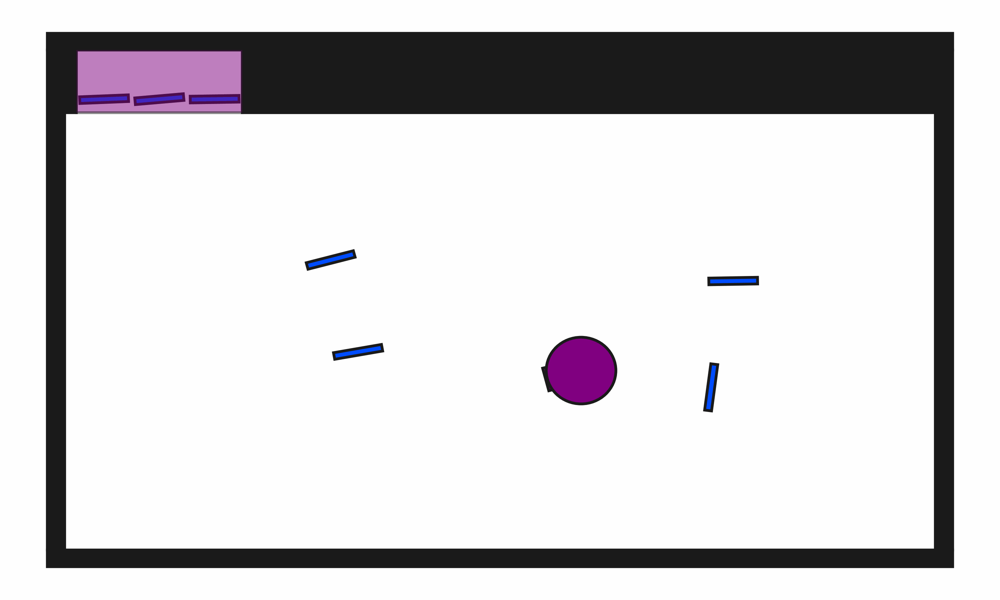

# prbench/ClutteredStorage2D-b7-v0

### Description
A 2D environment where the goal is to put all blocks inside a shelf.

There are always 7 blocks in this environment.

The robot has a movable circular base and a retractable arm with a rectangular vacuum end effector. Objects can be grasped and ungrasped when the end effector makes contact.

### Initial State Distribution

### Example Demonstration

### Observation Space
The entries of an array in this Box space correspond to the following object features:
| **Index** | **Object** | **Feature** |
| --- | --- | --- |
| 0 | robot | x |
| 1 | robot | y |
| 2 | robot | theta |
| 3 | robot | base_radius |
| 4 | robot | arm_joint |
| 5 | robot | arm_length |
| 6 | robot | vacuum |
| 7 | robot | gripper_height |
| 8 | robot | gripper_width |
| 9 | shelf | x |
| 10 | shelf | y |
| 11 | shelf | theta |
| 12 | shelf | static |
| 13 | shelf | color_r |
| 14 | shelf | color_g |
| 15 | shelf | color_b |
| 16 | shelf | z_order |
| 17 | shelf | width |
| 18 | shelf | height |
| 19 | block0 | x |
| 20 | block0 | y |
| 21 | block0 | theta |
| 22 | block0 | static |
| 23 | block0 | color_r |
| 24 | block0 | color_g |
| 25 | block0 | color_b |
| 26 | block0 | z_order |
| 27 | block0 | width |
| 28 | block0 | height |
| 29 | block1 | x |
| 30 | block1 | y |
| 31 | block1 | theta |
| 32 | block1 | static |
| 33 | block1 | color_r |
| 34 | block1 | color_g |
| 35 | block1 | color_b |
| 36 | block1 | z_order |
| 37 | block1 | width |
| 38 | block1 | height |
| 39 | block2 | x |
| 40 | block2 | y |
| 41 | block2 | theta |
| 42 | block2 | static |
| 43 | block2 | color_r |
| 44 | block2 | color_g |
| 45 | block2 | color_b |
| 46 | block2 | z_order |
| 47 | block2 | width |
| 48 | block2 | height |
| 49 | block3 | x |
| 50 | block3 | y |
| 51 | block3 | theta |
| 52 | block3 | static |
| 53 | block3 | color_r |
| 54 | block3 | color_g |
| 55 | block3 | color_b |
| 56 | block3 | z_order |
| 57 | block3 | width |
| 58 | block3 | height |
| 59 | block4 | x |
| 60 | block4 | y |
| 61 | block4 | theta |
| 62 | block4 | static |
| 63 | block4 | color_r |
| 64 | block4 | color_g |
| 65 | block4 | color_b |
| 66 | block4 | z_order |
| 67 | block4 | width |
| 68 | block4 | height |
| 69 | block5 | x |
| 70 | block5 | y |
| 71 | block5 | theta |
| 72 | block5 | static |
| 73 | block5 | color_r |
| 74 | block5 | color_g |
| 75 | block5 | color_b |
| 76 | block5 | z_order |
| 77 | block5 | width |
| 78 | block5 | height |
| 79 | block6 | x |
| 80 | block6 | y |
| 81 | block6 | theta |
| 82 | block6 | static |
| 83 | block6 | color_r |
| 84 | block6 | color_g |
| 85 | block6 | color_b |
| 86 | block6 | z_order |
| 87 | block6 | width |
| 88 | block6 | height |

### Action Space
The entries of an array in this Box space correspond to the following action features:
| **Index** | **Feature** | **Description** | **Min** | **Max** |
| --- | --- | --- | --- | --- |
| 0 | dx | Change in robot x position (positive is right) | -0.050 | 0.050 |
| 1 | dy | Change in robot y position (positive is up) | -0.050 | 0.050 |
| 2 | dtheta | Change in robot angle in radians (positive is ccw) | -0.196 | 0.196 |
| 3 | darm | Change in robot arm length (positive is out) | -0.100 | 0.100 |
| 4 | vac | Directly sets the vacuum (0.0 is off, 1.0 is on) | 0.000 | 1.000 |

### Rewards
A penalty of -1.0 is given at every time step until termination, which occurs when all blocks are inside the shelf.

### References
Similar environments have been considered by many others, especially in the task and motion planning literature.
