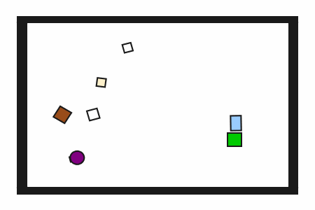
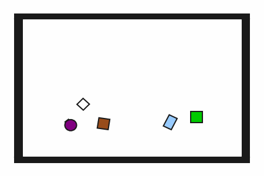

# prbench/CoffeeMaking2D-coffee-full-v0

### Description
A 2D kitchen environment where the goal is to make coffee and place the finished cup on a green coaster.

The robot must manipulate various objects including a coffee pot, water pitcher, coffee cup, and optional ingredients. The robot can optionally add cream and sugar to the coffee.

The task is complete when the coffee cup is successfully placed on the green coaster near the edge of the workspace.

The robot has a movable circular base and a retractable arm with a rectangular vacuum end effector. Objects can be grasped and ungrasped when the end effector makes contact.

### Initial State Distribution

### Example Demonstration

### Observation Space
The entries of an array in this Box space correspond to the following object features:
| **Index** | **Object** | **Feature** |
| --- | --- | --- |
| 0 | robot | x |
| 1 | robot | y |
| 2 | robot | theta |
| 3 | robot | base_radius |
| 4 | robot | arm_joint |
| 5 | robot | arm_length |
| 6 | robot | vacuum |
| 7 | robot | gripper_height |
| 8 | robot | gripper_width |
| 9 | coffee_pot | x |
| 10 | coffee_pot | y |
| 11 | coffee_pot | theta |
| 12 | coffee_pot | static |
| 13 | coffee_pot | color_r |
| 14 | coffee_pot | color_g |
| 15 | coffee_pot | color_b |
| 16 | coffee_pot | z_order |
| 17 | coffee_pot | width |
| 18 | coffee_pot | height |
| 19 | coffee_cup | x |
| 20 | coffee_cup | y |
| 21 | coffee_cup | theta |
| 22 | coffee_cup | static |
| 23 | coffee_cup | color_r |
| 24 | coffee_cup | color_g |
| 25 | coffee_cup | color_b |
| 26 | coffee_cup | z_order |
| 27 | coffee_cup | width |
| 28 | coffee_cup | height |
| 29 | water_pitcher | x |
| 30 | water_pitcher | y |
| 31 | water_pitcher | theta |
| 32 | water_pitcher | static |
| 33 | water_pitcher | color_r |
| 34 | water_pitcher | color_g |
| 35 | water_pitcher | color_b |
| 36 | water_pitcher | z_order |
| 37 | water_pitcher | width |
| 38 | water_pitcher | height |
| 39 | coaster | x |
| 40 | coaster | y |
| 41 | coaster | theta |
| 42 | coaster | static |
| 43 | coaster | color_r |
| 44 | coaster | color_g |
| 45 | coaster | color_b |
| 46 | coaster | z_order |
| 47 | coaster | width |
| 48 | coaster | height |
| 49 | cream_container | x |
| 50 | cream_container | y |
| 51 | cream_container | theta |
| 52 | cream_container | static |
| 53 | cream_container | color_r |
| 54 | cream_container | color_g |
| 55 | cream_container | color_b |
| 56 | cream_container | z_order |
| 57 | cream_container | width |
| 58 | cream_container | height |
| 59 | sugar_container | x |
| 60 | sugar_container | y |
| 61 | sugar_container | theta |
| 62 | sugar_container | static |
| 63 | sugar_container | color_r |
| 64 | sugar_container | color_g |
| 65 | sugar_container | color_b |
| 66 | sugar_container | z_order |
| 67 | sugar_container | width |
| 68 | sugar_container | height |

### Action Space
The entries of an array in this Box space correspond to the following action features:
| **Index** | **Feature** | **Description** | **Min** | **Max** |
| --- | --- | --- | --- | --- |
| 0 | dx | Change in robot x position (positive is right) | -0.050 | 0.050 |
| 1 | dy | Change in robot y position (positive is up) | -0.050 | 0.050 |
| 2 | dtheta | Change in robot angle in radians (positive is ccw) | -0.196 | 0.196 |
| 3 | darm | Change in robot arm length (positive is out) | -0.100 | 0.100 |
| 4 | vac | Directly sets the vacuum (0.0 is off, 1.0 is on) | 0.000 | 1.000 |

### Rewards
A penalty of -1.0 is given at every time step until termination, which occurs when the coffee cup is placed on the green coaster. The task encourages efficient completion of the coffee making process.

### References
This environment is inspired by the Kitchen2D framework from "Active model learning and diverse action sampling for task and motion planning" (Wang et al., IROS 2018) and coffee-making robotics research. The task demonstrates complex manipulation requiring sequential actions and precise pouring behaviors.
