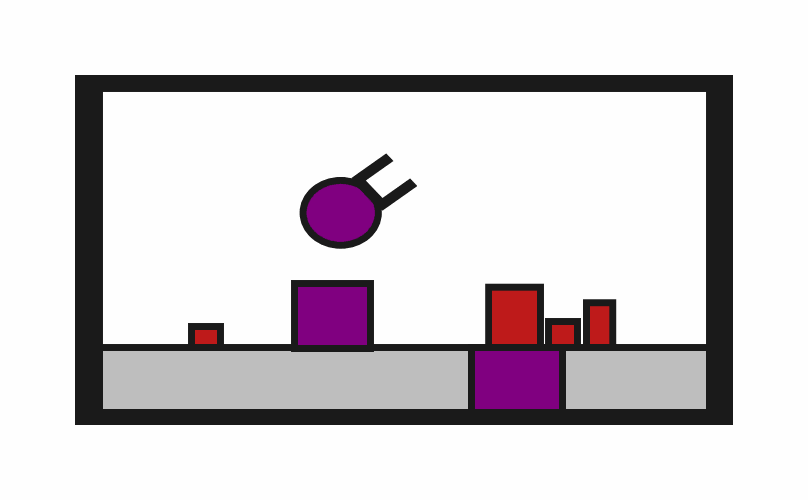

# prbench/DynObstruction2D-o4-v0


### Description
A 2D physics-based environment where the goal is to place a target block onto a target surface using a fingered robot with PyMunk physics simulation. The block must be completely on the surface.

The target surface may be initially obstructed. In this environment, there are always 5 obstacle blocks.

The robot has a movable circular base and an extendable arm with gripper fingers. Objects can be grasped and released through gripper actions. All objects follow realistic physics including gravity, friction, and collisions.

### Initial State Distribution


### Example Demonstration


### Observation Space
The entries of an array in this Box space correspond to the following object features:
| **Index** | **Object** | **Feature** |
| --- | --- | --- |
| 0 | target_surface | x |
| 1 | target_surface | y |
| 2 | target_surface | theta |
| 3 | target_surface | vx |
| 4 | target_surface | vy |
| 5 | target_surface | omega |
| 6 | target_surface | static |
| 7 | target_surface | kinematic |
| 8 | target_surface | dynamic |
| 9 | target_surface | color_r |
| 10 | target_surface | color_g |
| 11 | target_surface | color_b |
| 12 | target_surface | z_order |
| 13 | target_surface | width |
| 14 | target_surface | height |
| 15 | target_block | x |
| 16 | target_block | y |
| 17 | target_block | theta |
| 18 | target_block | vx |
| 19 | target_block | vy |
| 20 | target_block | omega |
| 21 | target_block | static |
| 22 | target_block | kinematic |
| 23 | target_block | dynamic |
| 24 | target_block | color_r |
| 25 | target_block | color_g |
| 26 | target_block | color_b |
| 27 | target_block | z_order |
| 28 | target_block | width |
| 29 | target_block | height |
| 30 | target_block | mass |
| 31 | target_block | moment |
| 32 | obstruction0 | x |
| 33 | obstruction0 | y |
| 34 | obstruction0 | theta |
| 35 | obstruction0 | vx |
| 36 | obstruction0 | vy |
| 37 | obstruction0 | omega |
| 38 | obstruction0 | static |
| 39 | obstruction0 | kinematic |
| 40 | obstruction0 | dynamic |
| 41 | obstruction0 | color_r |
| 42 | obstruction0 | color_g |
| 43 | obstruction0 | color_b |
| 44 | obstruction0 | z_order |
| 45 | obstruction0 | width |
| 46 | obstruction0 | height |
| 47 | obstruction1 | x |
| 48 | obstruction1 | y |
| 49 | obstruction1 | theta |
| 50 | obstruction1 | vx |
| 51 | obstruction1 | vy |
| 52 | obstruction1 | omega |
| 53 | obstruction1 | static |
| 54 | obstruction1 | kinematic |
| 55 | obstruction1 | dynamic |
| 56 | obstruction1 | color_r |
| 57 | obstruction1 | color_g |
| 58 | obstruction1 | color_b |
| 59 | obstruction1 | z_order |
| 60 | obstruction1 | width |
| 61 | obstruction1 | height |
| 62 | obstruction2 | x |
| 63 | obstruction2 | y |
| 64 | obstruction2 | theta |
| 65 | obstruction2 | vx |
| 66 | obstruction2 | vy |
| 67 | obstruction2 | omega |
| 68 | obstruction2 | static |
| 69 | obstruction2 | kinematic |
| 70 | obstruction2 | dynamic |
| 71 | obstruction2 | color_r |
| 72 | obstruction2 | color_g |
| 73 | obstruction2 | color_b |
| 74 | obstruction2 | z_order |
| 75 | obstruction2 | width |
| 76 | obstruction2 | height |
| 77 | obstruction3 | x |
| 78 | obstruction3 | y |
| 79 | obstruction3 | theta |
| 80 | obstruction3 | vx |
| 81 | obstruction3 | vy |
| 82 | obstruction3 | omega |
| 83 | obstruction3 | static |
| 84 | obstruction3 | kinematic |
| 85 | obstruction3 | dynamic |
| 86 | obstruction3 | color_r |
| 87 | obstruction3 | color_g |
| 88 | obstruction3 | color_b |
| 89 | obstruction3 | z_order |
| 90 | obstruction3 | width |
| 91 | obstruction3 | height |
| 92 | robot | x |
| 93 | robot | vx |
| 94 | robot | y |
| 95 | robot | vy |
| 96 | robot | theta |
| 97 | robot | omega |
| 98 | robot | base_radius |
| 99 | robot | arm_joint |
| 100 | robot | arm_length |
| 101 | robot | gripper_base_width |
| 102 | robot | gripper_base_height |
| 103 | robot | finger_gap |
| 104 | robot | finger_height |
| 105 | robot | finger_width |


### Action Space
The entries of an array in this Box space correspond to the following action features:
| **Index** | **Feature** | **Description** | **Min** | **Max** |
| --- | --- | --- | --- | --- |
| 0 | dx | Change in robot x position (positive is right) | -0.050 | 0.050 |
| 1 | dy | Change in robot y position (positive is up) | -0.050 | 0.050 |
| 2 | dtheta | Change in robot angle in radians (positive is ccw) | -0.196 | 0.196 |
| 3 | darm | Change in robot arm length (positive is out) | -0.100 | 0.100 |
| 4 | dgripper | Change in gripper gap (positive is open) | -0.020 | 0.020 |


### Rewards
A penalty of -1.0 is given at every time step until termination, which occurs when the target block is "on" the target surface. The definition of "on" is implemented using physics-based collision detection:
```python
def is_on(
    state: ObjectCentricState,
    top: Object,
    bottom: Object,
    static_object_cache: dict[Object, MultiBody2D],
    tol: float = 0.025,
) -> bool:
    """Checks top object is completely on the bottom one.

    Only rectangles are currently supported.

    Assumes that "up" is positive y.
    """
    top_geom = rectangle_object_to_geom(state, top, static_object_cache)
    bottom_geom = rectangle_object_to_geom(state, bottom, static_object_cache)
    # The bottom-most vertices of top_geom should be contained within the bottom
    # geom when those vertices are offset by tol.
    sorted_vertices = sorted(top_geom.vertices, key=lambda v: v[1])
    for x, y in sorted_vertices[:2]:
        offset_y = y - tol
        if not bottom_geom.contains_point(x, offset_y):
            return False
    return True
```


### References
This is a physics-based version of manipulation environments commonly used in robotics research. It extends the geometric obstruction environment to include realistic physics simulation using PyMunk, enabling more realistic robot manipulation scenarios.
