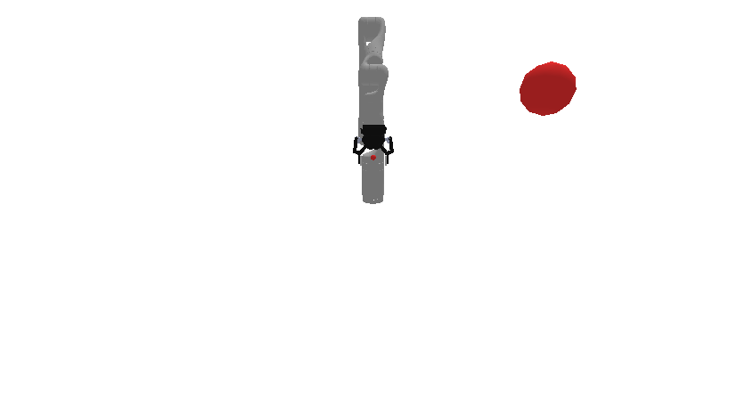

# prbench/Motion3D-v0

### Description
A 3D motion planning environment where the goal is to reach a target sphere with the robot's end effector.

The robot is a Kinova Gen-3 with 7 degrees of freedom. The target is a sphere with radius 0.100m positioned randomly within the workspace bounds.

The workspace bounds are:
- X: [0.0, 0.5]
- Y: [0.1, 0.8]
- Z: [0.0, 0.5]

Only targets that are reachable via inverse kinematics are sampled.

### Initial State Distribution

### Example Demonstration

### Observation Space
Observations consist of:
- **joint_positions**: Current joint positions of the 13-DOF robot arm (list of floats)
- **target**: 3D position (x, y, z) of the target sphere to reach (tuple of 3 floats)

The observation is returned as a Motion3DState dataclass with these two fields.

### Action Space
Actions control the change in joint positions:
- **delta_arm_joints**: Change in joint positions for all 13 joints (list of floats)

The action is a Motion3DAction dataclass with delta_arm_joints field. Each delta is clipped to the range [-0.050, 0.050].

The resulting joint positions are clipped to the robot's joint limits before being applied.

### Rewards
The reward structure is simple:
- **-1.0** penalty at every timestep until the goal is reached
- **Termination** occurs when the end effector is within 0.100m of the target center

This encourages the robot to reach the target as quickly as possible while avoiding infinite episodes.

### References
This is a very common kind of environment.
