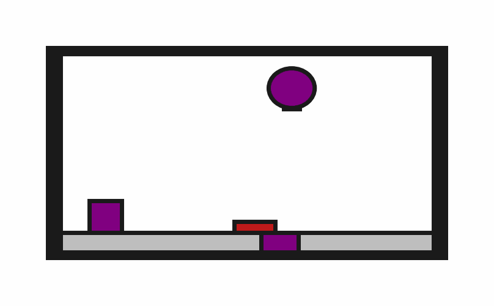

# prbench/Obstruction2D-o1-v0

### Description
A 2D environment where the goal is to place a target block onto a target surface. The block must be completely contained within the surface boundaries.

The target surface may be initially obstructed by one or more of the 1 obstacle blocks.
    
The robot has a movable circular base and a retractable arm with a rectangular vacuum end effector. Objects can be grasped and ungrasped when the end effector makes contact.
### Initial State Distribution

