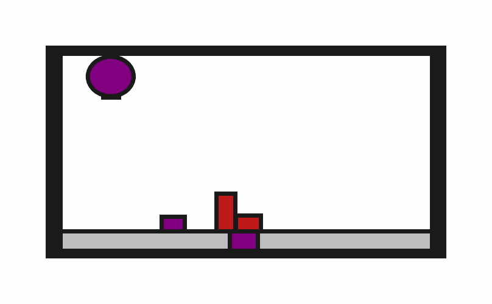

# prbench/Obstruction2D-o2-v0


### Description
A 2D environment where the goal is to place a target block onto a target surface. The block must be completely contained within the surface boundaries.

The target surface may be initially obstructed by one or more of the 2 obstacle blocks.
    
The robot has a movable circular base and a retractable arm with a rectangular vacuum end effector. Objects can be grasped and ungrasped when the end effector makes contact.

### Initial State Distribution


### Evidence of Solvability
Coming soon.

### Observation Space
TODO

### Action Space
TODO

### Rewards
A penalty of -1.0 is given at every time step until termination, which occurs when the target block is "on" the target surface. The definition of "on" is given below:
```python
def is_on(
    state: ObjectCentricState,
    top: Object,
    bottom: Object,
    static_object_cache: dict[Object, MultiBody2D],
    tol: float = 1e-1,
) -> bool:
    """Checks top object is completely on the bottom one.

    Only rectangles are currently supported.

    Assumes that "up" is positive y.
    """
    top_geom = rectangle_object_to_geom(state, top, static_object_cache)
    bottom_geom = rectangle_object_to_geom(state, bottom, static_object_cache)
    # The bottom-most vertices of top_geom should be contained within the bottom
    # geom when those vertices are offset by tol.
    sorted_vertices = sorted(top_geom.vertices, key=lambda v: v[1])
    for x, y in sorted_vertices[:2]:
        offset_y = y - tol
        if not bottom_geom.contains_point(x, offset_y):
            return False
    return True
```


