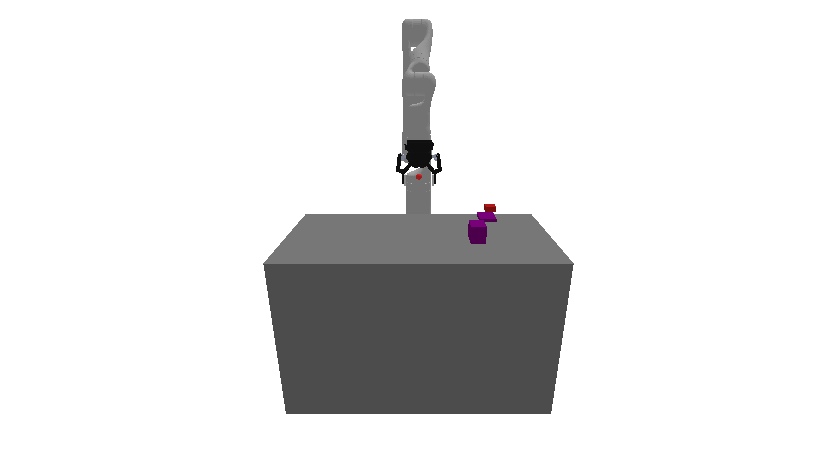

# prbench/Obstruction3D-o1-v0

### Description
A 3D obstruction clearance environment where the goal is to place a target block on a designated target region by first clearing obstructions.

The robot is a Kinova Gen-3 with 7 degrees of freedom that can grasp and manipulate objects. The environment consists of:
- A **table** with dimensions 0.400m × 0.800m × 0.500m
- A **target region** (purple block) with random dimensions between (0.02, 0.02, 0.005) and (0.05, 0.05, 0.005) half-extents
- A **target block** that must be placed on the target region, sized at 0.8× the target region's x,y dimensions
- **1 obstruction(s)** (red blocks) that may be placed on or near the target region, blocking access

Obstructions have random dimensions between (0.01, 0.01, 0.01) and (0.02, 0.02, 0.03) half-extents. During initialization, there's a 0.9 probability that each obstruction will be placed on the target region, requiring clearance.

The task requires planning to grasp and move obstructions out of the way, then place the target block on the target region.

### Initial State Distribution

### Example Demonstration

### Observation Space
Observations consist of:
- **joint_positions**: Current joint positions of the 13-DOF robot arm (list of floats)
- **grasped_object**: Name of currently grasped object, or None if not grasping anything (string or None)
- **grasped_object_transform**: Relative transform of grasped object to gripper, or None if not grasping (transform or None)
- **target_region**: State of the target region including:
  - pose: 3D position and orientation (Pose object)
  - geometry: Half-extents (width/2, height/2, depth/2) of the region (tuple of 3 floats)
- **target_block**: State of the target block including:
  - pose: 3D position and orientation (Pose object)
  - geometry: Half-extents of the block (tuple of 3 floats)
- **obstructions**: Dictionary of obstruction states, keyed by obstruction name (e.g., "obstruction0"), each containing:
  - pose: 3D position and orientation (Pose object)
  - geometry: Half-extents of the obstruction (tuple of 3 floats)

The observation is returned as an Obstruction3DState dataclass with these fields.

### Action Space
Actions control the change in joint positions:
- **delta_arm_joints**: Change in joint positions for all 13 joints (list of floats)

The action is an Obstruction3DAction dataclass with delta_arm_joints field. Each delta is clipped to the range [-0.050, 0.050].

The resulting joint positions are clipped to the robot's joint limits before being applied. The robot can automatically grasp objects when the gripper is close enough and release them with appropriate actions.

### Rewards
The reward structure is simple:
- **-1.0** penalty at every timestep until the goal is reached
- **Termination** occurs when the target block is placed on the target region (while not being grasped)

The goal is considered reached when:
1. The robot is not currently grasping the target block
2. The target block is resting on (supported by) the target region

This encourages the robot to efficiently clear obstructions and place the target block while avoiding infinite episodes.

### References
Similar environments have been used many times, especially in the task and motion planning literature. We took inspiration especially from the "1D Continuous TAMP" environment in [PDDLStream](https://github.com/caelan/pddlstream).
