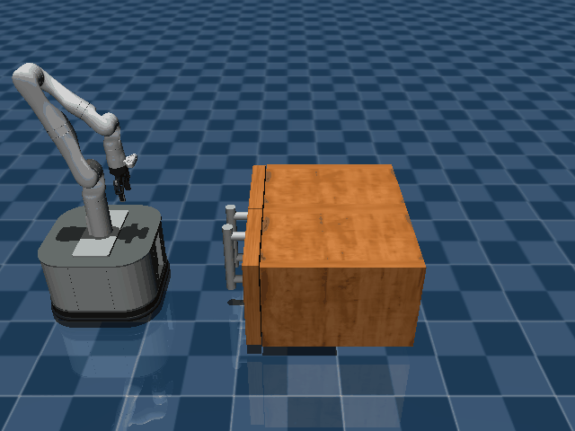

# prbench/TidyBot3D-cabinet-o3-mp_cabinet_two_phase-v0

### Description
A 3D mobile manipulation environment using the TidyBot platform.
        
The robot has a holonomic mobile base with powered casters and a Kinova Gen3 arm.
Scene type: cabinet with 3 objects.
Policy type: mp_cabinet_two_phase

Available scenes:
- table: Object stacking and manipulation on a table
- drawer: Opening/closing drawers and placing objects inside
- cupboard: Opening cupboards and organizing objects
- cabinet: Cabinet manipulation tasks

Available policy types:
- stack: Object stacking policies
- stack_three: Three-object stacking policies
- mp: Motion planning policies
- mp_three: Three-sequential motion planning
- mp_cabinet_two_phase: Two-phase cabinet manipulation
- custom_grasp: Custom grasping policies
- custom_grasp_three: Three-sequential custom grasping
- mp_n_cupboard: N-object cupboard manipulation

The robot can control:
- Base pose (x, y, theta)
- Arm position (x, y, z)
- Arm orientation (quaternion)
- Gripper position (open/close)

### Initial State Distribution

### Example Demonstration

### Observation Space
Observation includes:
- Robot state: base pose, arm position/orientation, gripper state
- Object states: positions and orientations of all objects
- Camera images: RGB images from base and wrist cameras
- Scene-specific features: handle positions for cabinets/drawers

### Action Space
Actions control:
- base_pose: [x, y, theta] - Mobile base position and orientation
- arm_pos: [x, y, z] - End effector position in world coordinates
- arm_quat: [x, y, z, w] - End effector orientation as quaternion
- gripper_pos: [pos] - Gripper open/close position (0=closed, 1=open)

### Rewards
Reward function depends on the specific task:
- Object stacking: Reward for successfully stacking objects
- Drawer/cabinet tasks: Reward for opening/closing and placing objects
- General manipulation: Reward for successful pick-and-place operations

Currently returns a small negative reward (-0.01) per timestep to encourage exploration.

### References
TidyBot++: An Open-Source Holonomic Mobile Manipulator for Robot Learning
Jimmy Wu, William Chong, Robert Holmberg, Aaditya Prasad, Yihuai Gao, Oussama Khatib, Shuran Song, Szymon Rusinkiewicz, Jeannette Bohg
Conference on Robot Learning (CoRL), 2024

https://github.com/tidybot2/tidybot2
