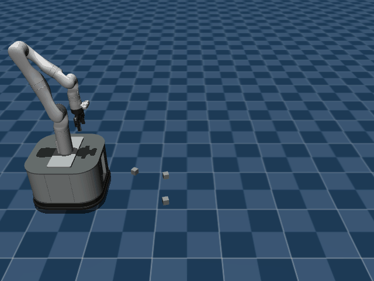

# prbench/TidyBot3D-ground-o3-mp-v0

### Description
A 3D mobile manipulation environment using the TidyBot platform.
        
The robot has a holonomic mobile base with powered casters and a Kinova Gen3 arm.
Scene type: ground with 3 objects. In the 'ground' scene, objects are placed randomly on a flat ground plane.

The robot can control:
- Base pose (x, y, theta)
- Arm position (x, y, z)
- Arm orientation (quaternion)
- Gripper position (open/close)

### Initial State Distribution

### Example Demonstration

### Observation Space
Observation includes:
- Robot state: base pose, arm position/orientation, gripper state
- Object states: positions and orientations of all objects
- Camera images: RGB images from base and wrist cameras
- Scene-specific features: handle positions for cabinets/drawers

### Action Space
Actions control:
- base_pose: [x, y, theta] - Mobile base position and orientation
- arm_pos: [x, y, z] - End effector position in world coordinates
- arm_quat: [x, y, z, w] - End effector orientation as quaternion
- gripper_pos: [pos] - Gripper open/close position (0=closed, 1=open)

### Rewards
The primary reward is for successfully placing objects at their target locations. # pylint: disable=line-too-long
- A reward of +1.0 is given for each object placed within a 5cm tolerance of its target.
- A smaller positive reward is given for objects within a 10cm tolerance to guide the robot.
- A small negative reward (-0.01) is applied at each timestep to encourage efficiency.
The episode terminates when all objects are placed at their respective targets.

### References
TidyBot++: An Open-Source Holonomic Mobile Manipulator
for Robot Learning
- Jimmy Wu, William Chong, Robert Holmberg, Aaditya Prasad, Yihuai Gao, 
  Oussama Khatib, Shuran Song, Szymon Rusinkiewicz, Jeannette Bohg
- Conference on Robot Learning (CoRL), 2024

https://github.com/tidybot2/tidybot2
